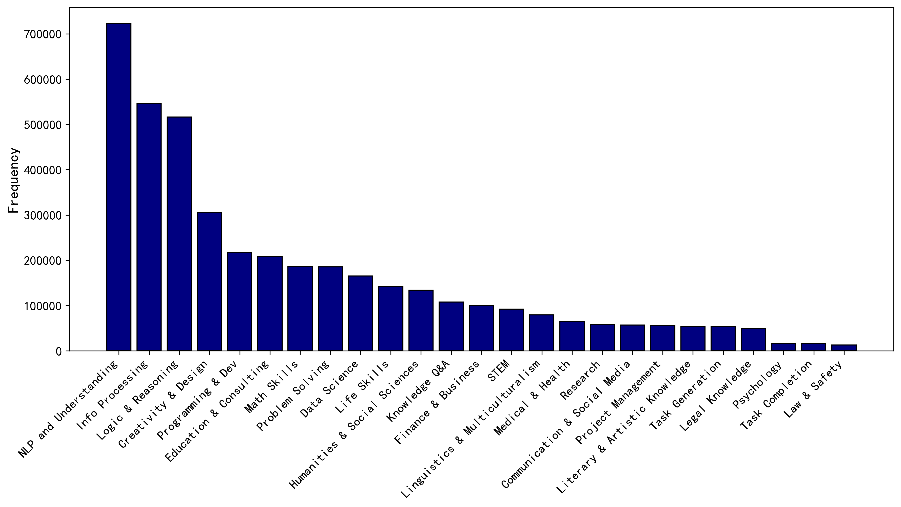
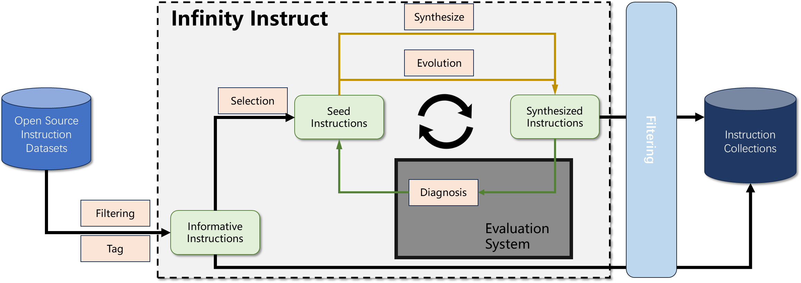

# Infinity-Instruct

## **Infinity Instruct**

Beijing Academy of Artificial Intelligence (BAAI)

The quality and scale of instruction data are crucial for model performance. Recently, open-source models have increasingly relied on fine-tuning datasets comprising millions of instances, necessitating both high quality and large scale. However, the open-source community has long been constrained by the high costs associated with building such extensive and high-quality instruction fine-tuning datasets, which has limited related research and applications. To address this gap, we are introducing the **Infinity Instruct **project, aiming to develop a large-scale, high-quality instruction dataset.

## **News**

- 🔥🔥🔥[2024/06/13] We are pleased to share the results of our intermediate checkpoints. Our ongoing efforts focus on risk assessment and data generation. The finalized version with 10 million instructions is scheduled for release in late June.

Flopsera [[http://open.flopsera.com/flopsera-open/details/InfinityInstruct](http://open.flopsera.com/flopsera-open/details/InfinityInstruct)]

huggingface[[https://huggingface.co/datasets/BAAI/Infinity-Instruct](https://huggingface.co/datasets/BAAI/Infinity-Instruct)]

## **GPT-4 automatic evaluation**

*denotes the results come from [web](https://huggingface.co/abacusai)

## Performance on **Downstream tasks**

## **Overview of Infinity Instruct**

## **Data sources **

We collect large-scale instruct data from the open-source community. The data sources are listed as follows:

- <u>OpenHermes-2.5</u><u> </u>
- [UltraInteract_sft](https://huggingface.co/datasets/openbmb/UltraInteract_sft)
- [CodeBagel](https://huggingface.co/datasets/Replete-AI/code_bagel)
- [CodeFeedback-Filtered-Instruction](https://huggingface.co/datasets/m-a-p/Code-Feedback)
- [self-oss-instruct-sc2-exec-filter-50k](https://huggingface.co/datasets/bigcode/self-oss-instruct-sc2-exec-filter-50k)
- [CodeExercise-Python-27k](https://huggingface.co/datasets/codefuse-ai/CodeExercise-Python-27k)
- [Evol-Instruct-Code-80k-v1](https://huggingface.co/datasets/nickrosh/Evol-Instruct-Code-80k-v1)
- [MathInstruct](https://huggingface.co/datasets/TIGER-Lab/MathInstruct)
- [orca-math-word-problems-200k](https://huggingface.co/datasets/microsoft/orca-math-word-problems-200k)
- [MetaMathQa](https://huggingface.co/datasets/meta-math/MetaMathQA)

The detailed information on Infinity-Instruct 0601 is shown in the following table.

- **Source and number of subjective instructions:**

The domain distribution of the subjective instruction category are shown in the following picture.

## **Instruction Selection for downstream tasks**

To create an objective ranking, we utilize datasets such as Flan and OpenHermes, with a focus on enhancing code and math capabilities. The method includes detailed topic distribution tagging of the evaluation set (e.g., data structures, sorting in humaneval). We apply heuristic rules to filter out irrelevant data based on the dataset source (e.g., removing network or file I/O operations). We further retrieve a subset from the training set based on the distribution in the validation sets.

## **Instruction ****G****eneration for ****H****igh-****Q****uality ****R****esponse**

### High-Quality Open Source Instruction Collection and Tag System

We start by collecting high-quality open-source instruction sets. We assign each instruction in the collection a set of tags that describe the abilities and knowledge necessary to complete the instruction. With this tagging system, we can recognize the content distribution of the collection and the abilities required for completing different tasks.

- Instruction collection: We systematically reviewed available open-source instruction sets and included sets created by humans and advanced LLMs.
- Tag System: with totally two levels:

  - First level tag: Describe the specific knowledge and abilities required for completing each instruction (e.g., Arithmetic Calculation, Knowledge of Biology). The tags are automatically generated by LLM.
  - Second level tags： Macro categories such as "Natural Language Processing" and "Math Reasoning."  Including 25 categories in total.

### Informative Instruction Selection

Aimed at selecting most informative instructions from the whole collection for enhancing the performance of LLM and improving user experience.

- Informative Instructions:
  - Instructions demand multiple kinds of abilities or multiple domains of knowledge. Such instructions are recognized by our tag system.
  - Instructions with long-tailed ability or knowledge;
  - Instructions with high following difficulty. The following difficulty of instructions is obtained using the method of Li et al. [1].

### Instruction Generation by Data Evolution Strategy

We expand the seed instructions in directions breadth, depth, difficulty, and complexity with a method built based on [2], and use AI assistants to generate multi-turn data.

- Based on the metadata selected in the previous section, we expand the instructions by randomly selecting one dimension from breadth, depth, difficulty and complexity dimensions on the basis of the Evol-Instruct method.
- Validate the evolved data, and use AI assistants to eliminate data that failed to evolve from the perspective of instruction compliance.
- Use the evolved instructions as the initial input, and use an AI assistant to play different roles to generate 2 to 4 rounds of dialogue for each instruction.

### Instruction Generation by Model Ability Deficient Diagnosis

Automatically identifying weaknesses in the model's capabilities to guide the synthesis of data.

- Model performance evaluation System: Constituted by a collection of commonly used evaluation sets;
- Automatic ability deficient diagnosis: Inducing shortcuts based on ground truth answers and model outputs using AI assistants;
- Targeted data synthesis: Automatically generate new instructions using AI assistants based on the induced deficiencies.

## **Disclaimer**

The resources, including code, data, and model weights, associated with this project are restricted for academic research purposes only and cannot be used for commercial purposes. The content produced by any version of Infinity Instruct is influenced by uncontrollable variables such as randomness, and therefore, the accuracy of the output cannot be guaranteed by this project. This project does not accept any legal liability for the content of the model output, nor does it assume responsibility for any losses incurred due to the use of associated resources and output results.

## 

## Reference

[1] Li M, Zhang Y, He S, et al. Superfiltering: Weak-to-strong data filtering for fast instruction-tuning[J]. arXiv preprint arXiv:2402.00530, 2024.

[2] Xu C, Sun Q, Zheng K, et al. WizardLM: Empowering large pre-trained language models to follow complex instructions[C]//The Twelfth International Conference on Learning Representations. 2023.
